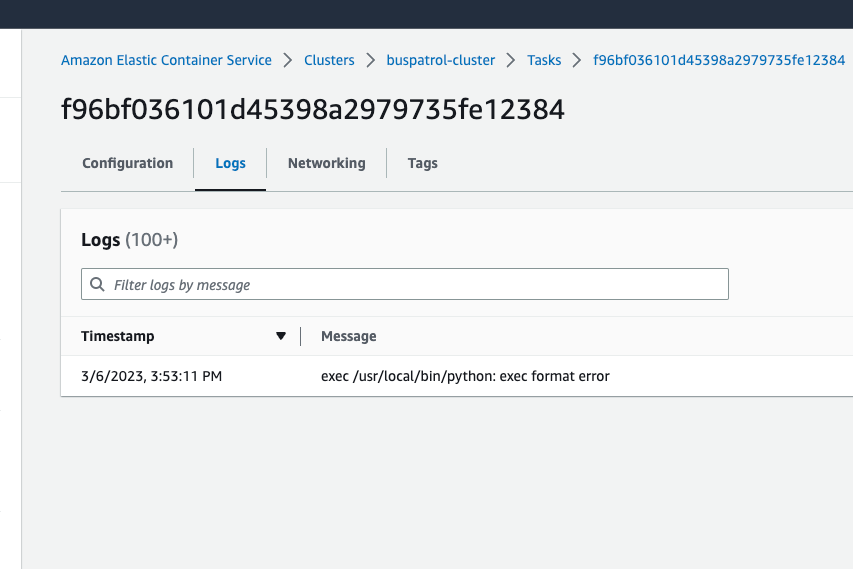
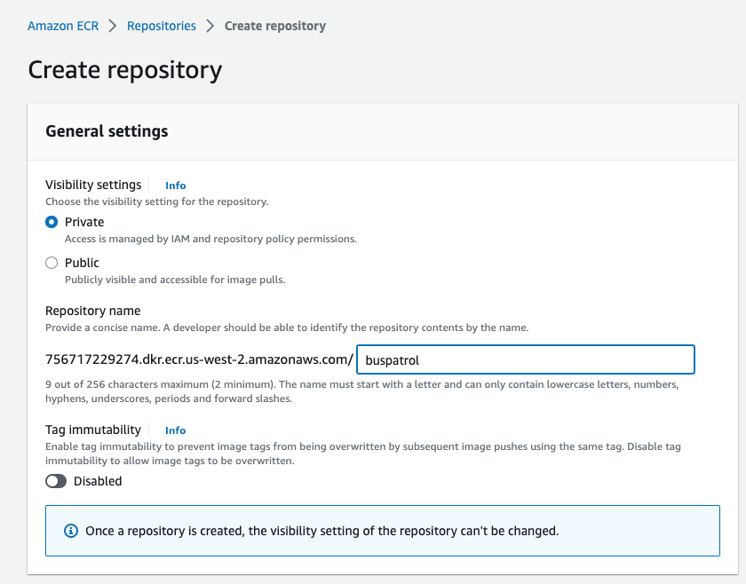

# NOTE
* I am having trouble with the terraform piece in AWS ECS. I suspect it has to do with the fact that the image I built was done on my laptop running on a Mac M1 ARM arch, not x86.  This is causing an error and this stackoverflow link I think explains it.
https://stackoverflow.com/a/67362007

## Building the Dockerfile

* From the root of this project, run `docker build .`

## Push the Dockerfile to ECR in AWS

* First, make sure to specify the name of the bucket you want on line five of the dockerfile. I will name mine joelauzzebucket for the sake of this demonstration:
  * CMD ["python", "./main.py","joelauzzebucket"]
* Next, build the Dockerfile locally with the following command:

`docker build . -t 'buspatrol_python'`

* Verify the image is built by running `docker images`. You should see an image tagged `buspatrol_python`.
* Create the ECR repo either through the CLI or AWS Console (I chose the latter for the sake of simplicty). Name it `buspatrol`.

* Now we can push the image up to ECR with a command like this:
https://docs.aws.amazon.com/AmazonECR/latest/userguide/docker-push-ecr-image.html
* My commands after following the above directions look like so:
  * `aws ecr get-login-password --region us-west-2 | docker login --username AWS --password-stdin 756717229274.dkr.ecr.us-west-2.amazonaws.com`
  * `docker tag {YOURLOCALIMAGEID} 756717229274.dkr.ecr.us-west-2.amazonaws.com/buspatrol`
  * `docker push e447b3a0a5b2 756717229274.dkr.ecr.us-west-2.amazonaws.com/buspatrol`

## Terraform instructions

* Proceed from the root of the repo to the `aws > tf > service > fargate_buspatrol` directory.
* Once there, run `terraform init`
* Perform a plan by running `terraform plan --out plan`.
* If the plan seems reasonable, you may now apply by doing `terraform apply plan`.